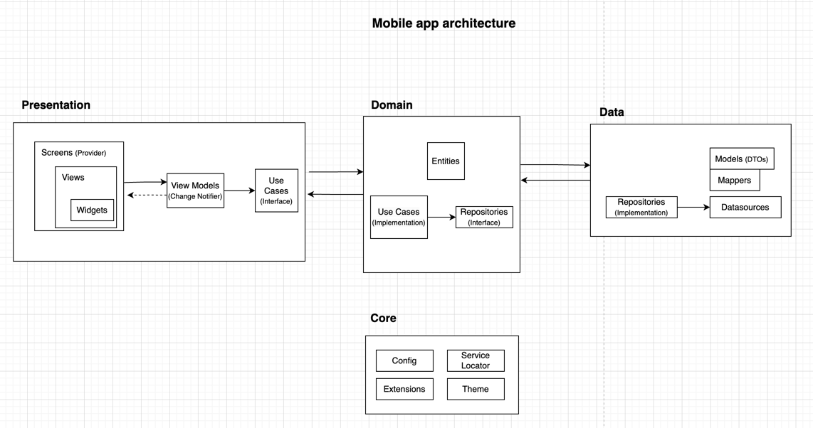

# Google Maps Implemented Weather Prediction (Flutter app)

Welcome to Solar Energy Prediction, the Stori Mobile Take-Home test for Flutter mobile developers.

# What's included

1. A Flutter app with modular architecture, Domain Driven Design, MVVM, SOLID principles, and Provider state management.



2. Besides, libraries and frameworks such as:
- **animate_do**: for widget animation purposes.
- **dartz**: for Either wrapper.
- **dio**: for network requests.
- **flutter_dotenv**: for reading .env config files.
- **get_it**: for service locator feature.
- **go_router**: for navigation purposes.
- **golden_toolkit**: for golden testing.
- **google_maps_flutter**: for maps navigation.
- **intl**: for texts internationalization.
- **json_annotation**: for json mappers creation.
- **location**: for gps and location services.
- **mockito**: to create mocks and define stubs in tests.
- **provider**: for state management.

3. This project contains unit tests, widget tests, and golden tests.


### Project structure

(L1)
- **lib**: root of the Flutter app. All project's code resides here.
- **android**: this folder contains native setup for the Android app, such as location permissions definition and maps key setup.
- **ios**: this folder contains native setup for the iOS app, such as location permissions definition and maps key setup.

(L2)
- **core**: a folder to place all shared logic that cannot be represented by the Clean Architecture layers. For instance, routing framework, string resources, mixins classes of utilities, service locator...
- **features**: a folder containing all app features. In this case, the map feature is included here.

(L3)
- **map**: this folder represents the _map feature_. This is divided by 3 layers which are presented below.

(L4)
- **presentation**: this layer contains UI, widgets, and defined interactions that serve as entry point for the users.
- **domain**: here, you can find the core of the app. All business rules related to the problem to be solved are included. Entities and UseCases will indicate what this weather app is about.
- **infrastructure**: this layer defines the access to external services such as OpenWeatherAPI or other datasources.


## Software Requirements

- **Flutter SDK**: [Install Flutter](https://flutter.dev/docs/get-started/install)
- **Dart Programming Language**
- **Integrated Development Environment (IDE)**: Use your preferred IDE, such as Visual Studio Code or IntelliJ IDEA.
- **Version Control System**: Git for version control.
- **Flutter Packages**:
  - google_maps_flutter
  - geolocator
  - location
  - flutter_map
  - geocoding
  - url_launcher
  - permission_handler
- **Firebase Account**: [Create a Firebase Account](https://firebase.google.com/)
- **Database**: Set up a Firebase Realtime Database.

## Hardware Requirements

### Computer

- **Processor**: Intel i3/i5/i7/i9 or equivalent AMD Processor.
- **Memory**: 4GB RAM minimum, 8 GB or more recommended.
- **Disk Space**: Minimum of 5 GB free disk space, SSD preferred.
- **Operating System**: Windows (7 SP1 or later), macOS, or Linux.

### Mobile Devices (for testing)

- **iOS**: iPhone or iPad running the latest iOS version.
- **Android**: Android phone or tablet with a recent Android version.

## Network Connection

A stable internet connection is required for:

- Downloading dependencies.
- Accessing APIs.
- Testing network-related functionalities.

## Getting Started

1. Clone the repository:

   ```bash
   git clone https://github.com/your-username/flutter-google-maps-clone.git
   ```

2. Navigate to the project directory:

   ```bash
   cd flutter-google-maps-clone
   ```

3. Install dependencies:

   ```bash
   flutter pub get
   ```

4. Open the project in your preferred IDE.

## Dependencies

- **google_maps_flutter**: [Documentation](https://pub.dev/packages/google_maps_flutter)
- **geolocator**: [Documentation](https://pub.dev/packages/geolocator)
- **location**: [Documentation](https://pub.dev/packages/location)
- **flutter_map**: [Documentation](https://pub.dev/packages/flutter_map)
- **geocoding**: [Documentation](https://pub.dev/packages/geocoding)
- **flutter_polyline_points**: [Documentation](https://pub.dev/packages/flutter_polyline_points)
- **fluttertoast**: [Documentation](https://pub.dev/packages/fluttertoast)
- **provider**: [Documentation](https://pub.dev/packages/provider)
- **url_launcher**: [Documentation](https://pub.dev/packages/url_launcher)
- **permission_handler**: [Documentation](https://pub.dev/packages/permission_handler)

## Configuration

1. Set up a Firebase project and configure Firebase in your Flutter project.

2. Configure API keys for the required packages (e.g., Google Maps API).

## Usage

1. Run the application on your emulator or physical device.

2. Explore the map, search for locations, and test navigation functionalities.

